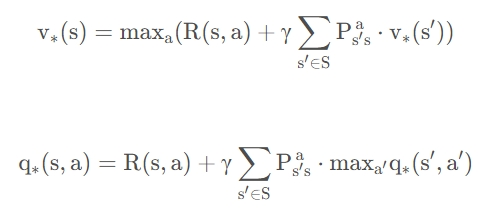
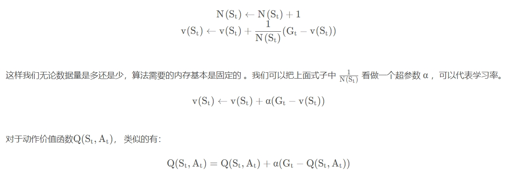
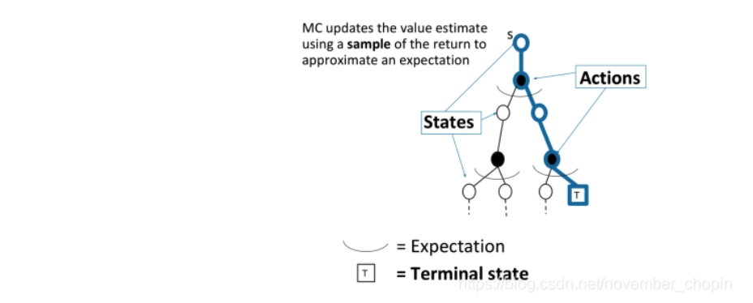

# 学习RL以及DRL过程中的记录

*这篇笔记是自己对RL相关知识的理解，重点是理出框架，并对相关知识有比较细致的了解，并结合pytorch代码，为以后的科研打基础*

*我的学习思路是以“莫烦python”和CSDN资料为纲，如果那里面有不懂的东西就查阅资料或者思考，搞懂为目标*

**首先，给出RL的框架图**

## 一、什么是强化学习

### 对强化学习的通俗描述

强化学习是机器学习大家族中的一大类, 使用**强化学习能够让机器学着如何在环境中拿到高分, 表现出优秀的成绩**。而这些成绩背后却是他所付出的辛苦劳动, 不断的试错, 不断地尝试, 累积经验, 学习经验。

强化学习是一类算法, 是让计算机实现从一开始什么都不懂, 脑袋里没有一点想法, 通过不断地尝试, 从错误中学习, **最后找到规律, 学会了达到目的的方法**。这就是一个完整的强化学习过程。

实际中的强化学习例子有很多. 比如近期最有名的 Alpha go, 机器头一次在围棋场上战胜人类高手, 让计算机自己学着玩经典游戏 Atari, 这些都是让计算机在不断的尝试中更新自己的行为准则, 从而一步步学会如何下好围棋, 如何操控游戏得到高分。既然要让计算机自己学, 那计算机通过什么来学习呢？

计算机需要一位虚拟的老师, 这个老师比较吝啬, **他不会告诉你如何行动, 如何做决定, 他只会给你的行为打分**。那我们应该以什么形式学习这些现有的资源, 或者说怎么样只从分数中学习到我应该怎样做决定呢? 很简单, 我只需要记住那些高分, 低分对应的行为, 下次用同样的行为拿高分, 并避免低分的行为。

比如老师会根据我的开心程度来打分, 我开心时, 可以得到高分, 我不开心时得到低分. 有了这些被打分的经验, 我就能判断为了拿到高分, 我应该选择一张开心的脸, 避免选到伤心的脸。这也是强化学习的核心思想。**可以看出在强化学习中, 一种行为的分数是十分重要的. 所以强化学习具有分数导向性**。我们换一个角度来思考，这种分数导向性好比我们在监督学习中的正确标签。

### 强化学习与监督学习的对比

对于监督学习, 是已经有了数据和数据对应的正确标签，监督学习就能学习出数据对应哪种标签. 不过强化学习还要更进一步, 一开始它并没有数据和标签。**它要通过一次次在环境中的尝试, 获取这些数据和标签, 然后再学习通过哪些数据能够对应哪些标签, 通过学习到的这些规律, 尽可能地选择带来高分的行为**。这也就证明了在强化学习中, 分数标签就是他的老师, 他和监督学习中的老师也差不多。

### RL有关算法

强化学习是一个大家族, 包含了很多种算法。比如有通过行为的价值来选取特定行为的方法, 包括使用表格学习的 q-learning, sarsa, 使用神经网络学习的 deep-q-network; 还有直接输出行为的 policy gradients; 又或者了解所处的环境, 想象出一个虚拟的环境并从虚拟的环境中学习, 等等。

## 二、强化学习方法分类

### Modelfree和Modelbased

我们可以将所有强化学习的方法分为理不理解所处环境。如果我们不尝试去理解环境, 环境给了我们什么就是什么. 我们就把这种方法叫做 model-free, **这里的 model 就是用模型来表示环境**, 那理解了环境也就是学会了用一个模型来代表环境, 所以这种就是 model-based 方法。

我们更通俗地说明这两种方法。假设环境就是我们的世界, 我们的机器人正在这个世界里玩耍, 他不理解这个世界是怎样构成的, 也不理解世界对于他的行为会怎么样反馈。举个例子, 他决定丢颗原子弹去真实的世界, 结果把自己给炸死了, 所有结果都是那么现实，这就是model-free。不过如果采取的是 model-based RL, 机器人会通过过往的经验, 先理解真实世界是怎样的, 并建立一个模型来模拟现实世界的反馈, 最后他不仅可以在现实世界中玩耍, 也能在模拟的世界中玩耍 , 这样就没必要去炸真实世界, 连自己也炸死了, 他可以像玩游戏一样炸炸游戏里的世界, 也保住了自己的小命。类似下图：

Model-free 的方法有很多, 像 Q-learning, Sarsa, Policy Gradients 都是从环境中得到反馈然后从中学习。 而 **model-based RL 只是多了一道程序, 为真实世界建模**, 也可以说他们都是 model-free 的强化学习, 只是 model-based 多出了一个虚拟环境, 我们不仅可以像 model-free 那样在现实中玩耍,还能在游戏中玩耍, **而玩耍的方式也都是 model-free 中那些玩耍方式**, 

**model-based 还有一个杀手锏是 model-free 所没有的，那就是想象力**。Model-free 中, 机器人只能按部就班, 一步一步等待真实世界的反馈, 再根据反馈采取下一步行动。而 model-based, 他能通过想象来预判断接下来将要发生的所有情况，然后选择这些想象情况中最好的那种，并依据这种情况来采取下一步的策略。这也就是围棋场上 AlphaGo 能够超越人类的原因。

### 基于概率和基于价值

基于概率是强化学习中最直接的一种, 他能通过感官分析所处的环境, 直接输出下一步要采取的各种动作的概率, 然后根据概率采取行动, 所以每种动作都有可能被选中, 只是可能性不同。而基于价值的方法输出则是所有动作的价值, 我们会根据最高价值来选着动作, 相比基于概率的方法, 基于价值的决策部分更为铁定, 毫不留情, 就选价值最高的, 而基于概率的, 即使某个动作的概率最高, 但是还是不一定会选到他。**也就是说，基于概率是模型将按照概率进行选择，只是说概率大的选中的可能性大，而基于价值是模型将直接采取价值最高的行动，如果我们每次都执行概率最高的行动，则基于概率将转变成基于价值，且价值就是概率值**。

**我们现在说的动作都是一个一个不连续的动作, 而对于选取连续的动作, 基于价值的方法是无能为力的，我们却能用一个概率分布在连续动作中选取特定动作**。这也是基于概率的方法的优点之一。那么这两类使用的方法又有哪些呢?

在基于概率这边, 有 Policy Gradients, 在基于价值这边有 Q learning, Sarsa 等. 而且我们还能结合这两类方法的优势之处, 创造更牛的一种方法, **叫做 Actor-Critic, actor 会基于概率做出动作, 而 critic 会对做出的动作给出动作的价值**, 这样就在原有的 policy gradients 上加速了学习过程。

### 回合更新和单步更新

强化学习还能用另外一种方式分类, 回合更新和单步更新。假设强化学习就是在玩游戏, 游戏回合有开始和结束。回合更新指的是游戏开始后, 我们要等待游戏结束, 然后再总结这一回合中的所有转折点, 再更新我们的行为准则。而单步更新则是在游戏进行中每一步都在更新, 不用等待游戏的结束, 这样我们就能边玩边学习了。

再来说说方法, Monte-carlo learning 和基础版的 policy gradients 等都是回合更新制, Qlearning, Sarsa, 升级版的 policy gradients 等都是单步更新制。因为单步更新更有效率, 所以现在大多方法都是基于单步更新。比如有的强化学习问题并不属于回合问题。

### 在线学习和离线学习

最后一种分类方式是在线学习和离线学习。所谓在线学习, 就是指我必须本人在场, 并且一定是本人边做边学习。而离线学习是你可以选择自己玩, 也可以选择看着别人玩, 通过看别人玩来学习别人的行为准则, 离线学习同样是从过往的经验中学习, 但是这些过往的经历没必要是自己的经历, 任何人的经历都能被学习。或者我也不必要边玩边学习, 我可以白天先存储下来玩耍时的记忆, 然后晚上通过离线学习来学习白天的记忆。离线学习的方式更加灵活，能够符合多种要求。

最典型的在线学习就是 Sarsa 了, 还有一种优化 Sarsa 的算法, 叫做 Sarsa lambda。最典型的离线学习就是 Q learning, 后来人也根据离线学习的属性, 开发了更强大的算法, 比如让计算机学会玩电动的 Deep-Q-Network。

## 三、强化学习基础知识

### 强化学习介绍

强化学习任务通常使用**马尔可夫决策过程**（Markov Decision Process，简称MDP）来描述，具体而言：机器处在一个环境中，每个状态为机器对当前环境的感知；机器只能通过动作来影响环境，**当机器执行一个动作后，会使得环境按某种概率转移到另一个状态**；同时，环境会根据潜在的奖赏函数反馈给机器一个奖赏。综合而言，**强化学习主要包含四个要素：状态、动作、转移概率以及奖赏函数**。强化学习模式图如下：

​根据上图，**agent**(智能体)在进行某个任务时，首先与environment进行交互，产生新的状态state，同时环境给出奖励reward，如此循环下去，agent和environment不断交互产生更多新的数据。强化学习算法就是通过一系列动作策略与环境交互，产生新的数据，再利用新的数据去修改自身的动作策略，经过数次迭代后，**agent就会学习到完成任务所需要的动作策略**。

### 强化学习基本概念

<!-- ​**马尔可夫性**指当前状态包含了对未来预测所需要的有用信息，过去信息对未来预测不重要，该就满足了马尔科夫性，严格来说，**就是某一状态信息包含了所有相关的历史，只要当前状态可知，所有的历史信息都不再需要，当前状态就可以决定未来**，则认为该状态具有马尔科夫性。用公式描述为：

$$
\mathrm{P}\left(\mathrm{S}_{\mathrm{t}+1} \mid \mathrm{S}_{\mathrm{t}}\right)=\mathrm{p}\left(\mathrm{S}_{\mathrm{t}+1} \mid \mathrm{S}_{1}, \mathrm{~S}_{2}, \cdots, \mathrm{S}_{\mathrm{t}}\right)
$$
 -->
[学习链接](https://blog.csdn.net/november_chopin/article/details/106589197?utm_source=app&app_version=5.5.0&code=app_1562916241&uLinkId=usr1mkqgl919blen)

重点理解，概念太多，梳理一下：

1. 马尔可夫过程
   1. 首先介绍了什么是马尔科夫性，马尔可夫性的出现极大的减少了思考的数据量，只需要考虑当前，历史信息已包含在当前信息中。
   2. 马尔可夫过程又叫做马尔可夫链，可以用一个元组$\langle S, P\rangle$表示，其中，S为有限数量的状态集，P为状态转移概率$\mathrm{p}\left(\mathrm{S}_{\mathrm{t}+1}=\mathrm{s}^{\prime} \mid \mathrm{s}_{\mathrm{t}}=\mathrm{s}\right)$

2. 在马尔可夫奖励过程
   1. 马尔可夫奖励过程在马尔可夫过程的基础上增加了奖励函数R和衰减系数$\gamma$,马尔可夫奖励过程可以用元组$<\mathrm{S}, \mathrm{R}, \mathrm{P}, \gamma>$表示。
   2. **奖励函数R**的概念。
   
   在这里，我们可以发现，无论是奖励还是状态，我们都会考虑**时刻**和**当前状态**对该指标的影响。$S_t=s$ 代表在t时刻的状态为s，$R_{t+1}$代表t+1时刻的奖励，$R_s$代表s状态的奖励。因为$R_s$不会因为时间的不同而发生变化，所以其与时间无关，只受当前所处状态的影响。而且其中的时间步t也可以看作是中间变量，并不是主导的影响因素。
   3. 收获$G_t$,
      $$
        \mathrm{G}_{\mathrm{t}}=\mathrm{R}_{\mathrm{t}+1}+\gamma \mathrm{R}_{\mathrm{t}+2}+\gamma^{2} \mathrm{R}_{\mathrm{t}+3}+\cdots+\gamma^{\mathrm{T}-\mathrm{t}-1} \mathrm{R}_{\mathrm{T}}
      $$
   4. 折扣因子$\gamma$的概念，$\gamma$接近1，考虑越长远，接近0，考虑越短浅。
   5. 状态价值函数V(s)
      $$
        \mathrm{V}(\mathrm{s})=\mathrm{E}\left[\mathrm{G}_{\mathrm{t}} \mid \mathrm{S}_{\mathrm{t}}=\mathrm{s}\right]
      $$
      该函数已经与时间步无关，只与所处状态有关，因为通过期望已经消掉了时间步。
3. 贝尔曼方程 Bellman Equation
   使用贝尔曼方程状态价值 V 可以表示为
    $$
        \mathrm{V}(\mathrm{s})=\underbrace{\mathrm{R}(\mathrm{s})}_{\text {Immediate reward }}+\underbrace{\gamma \sum_{\mathrm{s}^{\prime} \in \mathrm{S}} \mathrm{P}\left(\mathrm{s}^{\prime} \mid \mathrm{s}\right) \mathrm{V}\left(\mathrm{s}^{\prime}\right)}_{\text {Discounted sum of future reward }}
    $$
4. 马尔可夫决策过程
   **马尔科夫决策过程**是在**马尔科夫奖励过程**的基础上加了 Decision 过程，相当于多了一个动作集合。可以用元组$<\mathrm{S}, \mathrm{A}, \mathrm{P}, \mathrm{R}, \gamma\rangle$表示。从马尔可夫过程到马尔可夫奖励过程再到马尔可夫决策过程，是一个不断完善的过程。**A**是有限行为集合，**S**是有限状态集合。**P**表示为：
   $$
    \mathrm{P}\left(\mathrm{s}_{\mathrm{t}+1}=\mathrm{s}^{\prime} \mid \mathrm{s}_{\mathrm{t}}=\mathrm{s}, \mathrm{a}_{\mathrm{t}}=\mathrm{a}\right)=\mathrm{P}\left[\mathrm{S}_{\mathrm{t}+1}=\mathrm{s}^{\prime} \mid \mathrm{S}_{\mathrm{t}}=\mathrm{s}, \mathrm{A}_{\mathrm{t}}=\mathrm{a}\right]
   $$
   **R**表示为 $\mathrm{R}\left(\mathrm{s}_{\mathrm{t}}=\mathrm{s}, \mathrm{a}_{\mathrm{t}}=\mathrm{a}\right)=\mathrm{E}\left[\mathrm{R}_{\mathrm{t}} \mid \mathrm{s}_{\mathrm{t}}=\mathrm{s}, \mathrm{a}_{\mathrm{t}}=\mathrm{a}\right]$
5. 策略
   策略本身是一组概率分布，策略用$\pi$表示，其元素 $\pi(\mathrm{a} \mid \mathrm{s})$表示某一状态 s 采取可能的行为 a 的概率。Policy定义“完整定义的”个体行为方式，即包括了个体在各状态下的所有行为和概率。同时某一确定的Policy是静态的，与时间无关。Policy仅和当前的状态有关，与历史信息无关，但是个体可以随着时间更新策略。强化学习的目的就是找到一个最好的策略，使得每一步的收益都最大。在周老师的讲解中，他说下面这两个公式将马尔科夫决策过程与马尔可夫奖励过程联系起来。
   
6. 我们引入策略，也可以理解为行动指南，更加规范的描述个体的行为，策略可以明确地告诉我们下一步极大概率做什么事情。下面我们要判断行动指南的价值，因此需要再引入**基于策略的价值函数**，这里的意思就是说我们要判断下一步的价值大不大，我们需要去衡量下一步的价值，并通过不断的训练，使得机器可以自动选择价值最大的动作作为下一步的操作。这里训练的作用是将策略与价值结合起来，使得下一步操作就是价值最大的动作。
   1. 基于策略的状态价值函数，通过期望将时间步消掉。我们知道策略就是用来描述各个不同状态下执行各个不同行为的概率，而状态价值是遵循当前策略时所获得的收获的期望，即状态 s 的价值体现为在该状态下遵循某一策略而采取所有可能行为的价值按行为发生概率的乘积求和。
        $$
        \mathrm{v}_{\pi}(\mathrm{s})=\mathrm{E}_{\pi}\left[\mathrm{G}_{\mathrm{t}} \mid \mathrm{S}_{\mathrm{t}}=\mathrm{s}\right]
        $$
   2. 基于策略的行为价值函数$\mathrm{q}_{\pi}(\mathrm{s}, \mathrm{a})$，它的意义是当前状态s执行某一具体行为a所能的到的收获的期望。
        $$
        \mathrm{q}_{\pi}(\mathrm{s}, \mathrm{a})=\mathrm{E}_{\pi}\left[\mathrm{G}_{\mathrm{t}} \mid \mathrm{S}_{\mathrm{t}}=\mathrm{s}, \mathrm{A}_{\mathrm{t}}=\mathrm{a}\right]
        $$
   3. 二者之间关系为：
        $$
        \mathrm{v}_{\pi}(\mathrm{s})=\sum_{\mathrm{a} \in \mathrm{A}} \pi(\mathrm{a} \mid \mathrm{s}) \cdot \mathrm{q}_{\pi}(\mathrm{s}, \mathrm{a})
        $$
    4. 综上所述，上面两个公式组合可得 **Bellman Expectation Equation**
         
7. 最优价值函数
    解决强化学习问题意味着要寻找一个最优的策略让个体在与环境交互过程中获得始终比其它策略都要多的收获，这个最优策略我们可以用$\pi_*$表示。一般来说，比较难去找到一个最优策略，但是可以通过比较若干不同策略的优劣来确定一个较好的策略，也就是局部最优解。
    我们一般是通过对应的价值函数来比较策略的优劣，也就是说，寻找较优策略可以通过寻找较优的价值函数来完成。因此，对于策略，我们也有了一个具体的衡量标准。
    1. 可以定义最优状态价值函数是所有策略下产生的众多状态价值函数中的最大者，即：
        $$
        \mathrm{V}_{*}(\mathrm{~s})=\max _{\pi} \mathrm{V}_{\pi}(\mathrm{s})
        $$
    2. 同理也可以定义最优动作价值函数是所有策略下产生的众多动作状态价值函数中的最大者，即：
        $$
        \mathrm{q}_{*}(\mathrm{s}, \mathrm{a})=\max _{\pi} \mathrm{q}_{\pi}(\mathrm{s}, \mathrm{a})
        $$
    在这个基础上，我们可以通过最大化最优行为价值函数来寻求最优策略。
    
    其中，1和0代表概率值，我们可以发现，机器只能去选择最优行为价值动作作为下一步操作，这就成为了一种策略。
    只要我们找到了最大的状态价值函数或者动作价值函数，那么对应的策略$\pi_*$就是我们强化学习问题的解。同时，利用状态价值函数和动作价值函数之间的关系，我们也可以得到：
    $$
    \mathrm{v}_{*}(\mathrm{~s})=\max _{\mathrm{a}} \mathrm{q}_{*}(\mathrm{~s}, \mathrm{a})
    $$
    即当到达最优的时候，一个**状态的价值**就等于在**当前状态下最大的那个动作价值**。
    把上面两个式子结合起来有**Bellman Optimality Equation**
    

我们需要重点掌握马尔可夫决策过程，策略以及策略价值函数。

## 四、用动态规划解决MDP问题

[学习资料](https://blog.csdn.net/november_chopin/article/details/107896549?utm_source=app&app_version=5.5.0&code=app_1562916241&uLinkId=usr1mkqgl919blen)

重点梳理：

1. 从最上面的图中我们可以明确**动态规划**算法在RL中所处的位置，其属于**基于模型**的范畴，有两种具体算法分别是**策略迭代**和**价值迭代**。动态规划的关键点有两个，分别是：
   1. 问题的最优解可以由若干小问题的最优解构成，即通过寻找子问题的最优解来得到问题的最优解。
   2. 可以找到子问题状态之间的递推关系，通过较小的子问题状态递推出较大的子问题的状态。
2. 强化学习的目标就是做 Decision Making，其分为两个过程：
   1. 策略评估
      输入为 MDP$<\mathrm{S}, \mathrm{A}, \mathrm{P}, \mathrm{R}, \gamma\rangle$和策略 $\pi$；
      输出为该策略的value function $V_\pi$
   2. 策略控制
      输入为 MDP$<\mathrm{S}, \mathrm{A}, \mathrm{P}, \mathrm{R}, \gamma\rangle$
      输出为最优的价值函数$V^*$和最优策略$\pi^*$
3. 策略评估
   策略评估是求解给定策略的状态价值函数的相应过程。策略评估的基本思路是从任意一个状态价值函数开始，依据给定的策略，结合贝尔曼期望方程、状态转移概率和奖励同步迭代更新状态价值函数，直至其收敛，得到该策略下最终的状态价值函数。假设我们在第 t 轮迭代已经计算出了所有的状态的状态价值 $V_t(s')$，那么在第 t+1 轮我们可以利用第 t 轮计算出的状态价值计算出第 t+1 轮的状态价值 $V_{t+1}(s)$。这是通过贝尔曼方程实现的：
   

4. 策略控制
   1. 策略迭代
      对于策略控制问题，一种可行的方法就是根据我们之前基于**任意一个给定策略**评估得到的状态价值来及时调整我们的动作策略，这个方法我们叫做策略迭代 (Policy Iteration)。如何调整呢？最简单的方法就是**贪婪法**。考虑一种如下的贪婪策略：个体在某个状态下选择的行为是其能够到达后续所有可能的状态中状态价值最大的那个状态。这是一个短视的思维，即只看当前状态下下一步所能到达的状态的价值，而不去宏观考虑策略的优越性，就是利用这种短视的思维，我们可以选择下一步的动作今儿选择策略。
      
      其思路就是​：如果我们有一个策略$\pi$，我们可以用现有策略估计出它的状态价值函数$v_\pi(s)$， 然后根据策略改进提取出更好的策略$\pi'$，接着再计算$v_{\pi'}(s)$，进而得到更好的策略。如此迭代，直至满足相关终止条件。
      
      其中，每个i前面都要加上策略$\pi$。
      为什么贪心算法可行呢，即当前状态下的最优解就是全局最优解，其原因如下：
      
      正是因为在最优解情况下，一个状态的价值就是当前状态下最大的动作价值，所以我们只需要关注当前状态下价值最大的动作，然后调整策略，最后生成的策略就是最优策略。
   2. 价值迭代
      价值迭代是策略迭代的优化，它更加聪明，迭代次数也更少。例如博客中的例子，我们不需要迭代到状态价值收敛再去调整策略，而是随着状态价值的迭代及时调整策略, 这样可以大大减少迭代次数。这是一种更加短视的贪心，该算法可以最大可能d保证正确性和速度。此时状态价值的更新方法也和策略迭代不同。现在的贝尔曼方程迭代式子如下：
      

5. 总结
   可以发现，在策略控制范畴中，对于这两个算法，有一个前提条件是奖励 R 和状态转移矩阵 P 我们是知道的，因此我们可以使用策略迭代和价值迭代算法。对于这种情况我们叫做 Model base。同理可知，如果我们不知道环境中的奖励和状态转移矩阵，我们叫做 Model free。那对于 Model free 情况下应该如何求解 MDP 问题呢？这就需要蒙特卡洛（MC）采样法。

## 五、使用蒙特卡洛解决无模型问题

[学习资料](https://blog.csdn.net/november_chopin/article/details/107896928?utm_source=app&app_version=5.5.0&code=app_1562916241&uLinkId=usr1mkqgl919blen)

重点梳理：

1. 这里需要明确一些知识。策略$\pi$和状态转移概率 P 不一样，他们两个有本质的区别。我们强化学习学习的是更好的策略，而有时这个 P 是已知的，是不需要我们迭代优化的。策略的定义是在某一状态下做出某一动作的概率，而状态转移概率 P 为已知当前状态和所做动作，转移为某一新的状态的概率。显然，状态转移依赖策略，当已知策略时，状态转移的概率应该是非常明确的。奖励 R，状态转移概率 P 和策略$\pi$之间的关系如下：
   
   具体实现可以看上一节中举的例子，按照例子分析动态规划的具体运行流程。
2. 背景
   在上一节中讲述的利用动态规划解决MDP时，介绍了两种算法，即策略迭代和价值迭代。可以发现，对于这两个算法，**有一个前提条件是奖励 R 和状态转移矩阵 P 我们是知道的**，因此我们可以使用策略迭代和价值迭代算法。对于这种情况我们叫做 Model base。同理可知，**如果我们不知道环境中的奖励和状态转移矩阵**，我们叫做 Model free。而且大部分的环境都是属于 Model Free 类型的，比如熟悉的雅达利游戏等等。另外动态规划还有一个问题：需要在每一次回溯更新某一个状态的价值时，回溯到该状态的所有可能的后续状态。导致对于复杂问题计算量很大。因此， Model free的应用场景更加广泛。
   对于 Model Free 类型的强化学习，此时需要**智能体直接和环境进行交互**，环境根据智能体的动作返回下一个状态和相应的奖励给智能体。这时候就需要**智能体搜集和环境交互的轨迹**（Trajectory / episode）。
   对于 Model Free 情况下的**策略评估**，我们介绍两种**采样**方法。**蒙特卡洛采样法**（Monte Carlo）和**时序差分法**（Temporal Difference）。策略评估是强化学习中的重要任务，这一节重点讲解蒙特卡洛采样法。
3. 蒙特卡洛采样法的基本原理
   对于Model Free，我们不知道奖励 R 和状态转移矩阵，那应该怎么办呢？很自然的，我们就想到，让**智能体和环境多次交互**，我们通过这种方法**获取大量的轨迹信息**，然后**根据这些轨迹信息来估计真实的 R 和 P**。这就是蒙特卡洛采样的思想。
   蒙特卡罗法通过采样**若干经历完整的状态序列**(Trajectory / episode)来估计状态的真实价值。所谓的经历完整，就是这个序列必须是达到终点的。比如下棋问题分出输赢，驾车问题成功到达终点或者失败。有了很多组这样经历完整的状态序列，我们就可以来近似的估计状态价值，进而求解**预测**和**控制**问题了。
4. 蒙特卡洛采样法解决预测问题
   蒙特卡洛采样法朴素的计算思路如下：
   
   上面预测问题的求解公式里，我们有一个average的公式，意味着要保存所有该状态的收获值之和最后取平均。这样浪费了太多的存储空间。一个较好的**改进**方法是在**迭代计算收获均值**，即**每次保存上一轮迭代得到的收获均值与次数**，当计算得到当前轮的收获时，即可计算当前轮收获均值和次数。改进思路用公式表示如下：
   
   利用这个方法，我们可以改进蒙特卡洛采样法的计算思路，其新的思路如下：
   
5. 蒙特卡洛采样法解决控制问题
   蒙特卡洛采样法求解控制问题的思路和动态规划策略迭代思路类似。对于**蒙特卡洛算法策略评估时一般是优化的动作价值函数$q_*$**，而不是状态价值函数$v_*$，所以评估方法利用如下公式来优化动作价值函数。
   $$
   \mathrm{Q}\left(\mathrm{S}_{\mathrm{t}}, \mathrm{A}_{\mathrm{t}}\right)=\mathrm{Q}\left(\mathrm{S}_{\mathrm{t}}, \mathrm{A}_{\mathrm{t}}\right)+\alpha\left(\mathrm{G}_{\mathrm{t}}-\mathrm{Q}\left(\mathrm{S}_{\mathrm{t}}, \mathrm{A}_{\mathrm{t}}\right)\right)
   $$
   
   我们可以看到，在选择策略时，蒙特卡洛采样法和动态规划方法的不同。**动态规划是完全的贪心**，直接选择当前最大价值的行为，但是，**蒙特卡洛采样法是用$1-\epsilon$来贪婪地选择当前价值最大的行为**，还会用$\epsilon$的概率去选择所有的行为，包括所认为的当前价值最大的行为。
   在实际求解控制问题时，为了使算法可以收敛，**一般 $\epsilon$ 会随着算法的迭代过程逐渐减小，并趋于0**。这样在迭代前期，我们鼓励探索，而在后期，由于我们有了足够的探索量，开始趋于保守，以贪婪为主，使算法可以稳定收敛。
6. 在策略评估中蒙特卡洛采样法与动态规划算法的不同
   1. 动态规划算法
      
   2. 蒙特卡洛采样法
      
      
7. 总结
   MC可以避免动态规划求解过于复杂，同时还可以不事先知道奖励和装填转移矩阵，因此**MC可以用于海量数据和复杂模型**。但是**它也有自己的缺点，这就是它每次采样都需要一个完整的状态序列**。如果我们没有完整的状态序列，或者很难拿到较多的完整的状态序列，这时候蒙特卡罗法就不太好用了。如何解决这个问题呢，就是下节要讲的时序差分法（TD）。

## 六、时序差分法（TD）的解决无模型的预测与控制（SARSA and Q-Learning）

我们讨论过 Model Free 情况下的策略评估问题，主要介绍了**蒙特卡洛**（MC）采样法的预测与控制问题，这次我们介绍另外一种方法——**时序差分法**（TD）。

[学习资料](https://blog.csdn.net/november_chopin/article/details/107897225?utm_source=app&app_version=5.5.0&code=app_1562916241&uLinkId=usr1mkqgl919blen)

重点梳理：

1. 蒙特卡洛采样法的局限
   对于MC采样法，如果我们没有完整的状态序列，那么就无法使用蒙特卡罗法求解了。**当获取不到完整状态序列时**，可以使用时序差分法(Temporal-Difference, TD)。
2. TD简介
   
   上述公式，我们均可以在上一节蒙特卡洛采样法中找到出处。在TD算法中，我们不再追求精确，而是利用近似思想来简化问题，扩大算法的作用范围。这样一来，这样我们只需要**两个连续的状态与对应的奖励**，就可以尝试求解强化学习问题了。
3. n步时序差分
   
   这个过程类似我们构建的模型，模型复杂度越来越高，拟合程度可能也会越来越好，但是当时间复杂度过高的时候，可能会造成过拟合。
4. TD小结
   首先看一下TD和MC的对比：
   
   TD在知道结果之前就可以学习，也可以在没有结果时学习，还可以在持续进行的环境中学习，而MC则要等到最后结果才能学习，**时序差分法可以更快速灵活的更新状态的价值估计**。TD在更新状态价值时使用的是TD 目标值，即基于即时奖励和下一状态的预估价值来替代当前状态在状态序列结束时可能得到的收获，在我看来，后面的部分可能会是高级无穷小，所以可以忽略，**TD是当前状态价值的有偏估计**。而MC则使用实际的收获来更新状态价值，是某一策略下状态价值的无偏估计，这点 MC 优于 TD。虽然TD得到的价值是有偏估计，但是TD算法方差却比MC得到的方差要低，且对初始值敏感，通常比MC更加高效。
5. TD具体算法
   TD对比MC有很多优势，比如TD有更低方差，可以学习不完整的序列。所以我们可以在策略控制循环中使用TD来代替MC。因此**现在主流的强化学习求解方法都是基于TD的**，下面我们就介绍两种最常用的算法，分别是 Q-Learning 和 Sarsa。

## 七、Sarsa
在强化学习中 Sarsa 和 Q learning 及其类似, 我们还是使用写作业和看电视这个例子. 没写完作业去看电视被打, 写完了作业有糖吃.

[学习资料1](https://mofanpy.com/tutorials/machine-learning/reinforcement-learning/intro-sarsa)

1. Sarsa决策
   
   **Sarsa 的决策部分和 Q learning 一模一样**, 因为我们使用的是 Q 表的形式决策, 所以我们会在 Q 表中挑选值较大的动作值施加在环境中来换取奖惩. 但是不同的地方在于 Sarsa 的更新方式是不一样的.同样，Sarsa和Q-Learning都是epsilon-greedy策略。下面，我们重点看一下Sarsa的更新过程。
2. Sarsa 更新行为准则
   
   同样, 我们会经历正在写作业的状态 s1, 然后再挑选一个带来最大潜在奖励的动作 a2, 这样我们就到达了继续写作业状态 s2, 而在这一步, 如果你用的是 Q-Learning, 你会观看一下在 s2 上选取哪一个动作会带来最大的奖励, 但是在真正要做决定时, 却不一定会选取到那个带来最大奖励的动作, **Q-Learning 在这一步只是估计了一下接下来的动作值. 而 Sarsa 是实践派, 他说到做到, 在 s2 这一步估算的动作也是接下来要做的动作**. 所以 Q(s1, a2) 现实的计算值, 我们也会稍稍改动, 去掉maxQ, 取而代之的是在 s2 上我们实实在在选取的 a2 的 Q 值. 最后像 Q-Learning 一样, 求出现实和估计的差距 并更新 Q 表里的 Q(s1, a2).
3. 对比Sarsa和Q-Learning算法
   
   从算法来看, 这就是他们两最大的不同之处了. **因为 Sarsa 是说到做到型, 所以我们也叫他 on-policy, 在线学习**, 学着自己在做的事情. **而 Q-Learning 是说到但并不一定做到, 所以它也叫作 Off-policy, 离线学习**. 而因为有了maxQ, Q-Learning 也是一个特别勇敢的算法.
   
   为什么说他勇敢呢, 因为 Q learning 机器人永远都会选择最近的一条通往成功的道路, 不管这条路会有多危险. 而 Sarsa 则是相当保守, 他会选择离危险远远的, 拿到宝藏是次要的, 保住自己的小命才是王道. 

[学习资料2](https://blog.csdn.net/november_chopin/article/details/107897225?app_version=5.7.4&code=app_1562916241&csdn_share_tail=%7B%22type%22%3A%22blog%22%2C%22rType%22%3A%22article%22%2C%22rId%22%3A%22107897225%22%2C%22source%22%3A%22m0_50244025%22%7D&uLinkId=usr1mkqgl919blen&utm_source=app)

重点梳理

1. Sarsa解析
   
   在这里，我们需要明确，Sarsa是实践派，它会基于$\epsilon$-greedy选取一个真实的动作，进入新的状态同时获取奖励。在我看来，它依旧是利用上一时刻的下一步动作奖励来更新这一时刻的当前动作奖励。在生成Q表后，我们就可以利用Q表来决策，其流程与Q-Learning一样。
   **关键thinking**：我到这里有一点明白为什么Sarsa被称为在线学习或者是同策略学习了。它应该是边学边做，利用$\epsilon$-greedy选择一个动作后，我们利用它来更新Q表，同时算法也直接做出这个动作。通过品读下面的算法流程，我们也可以看出，它是更新完Q表后，直接把A'赋值给A，在下一次迭代时，直接做出A'这个动作。因此它是在行动过程中不断地学习，适宜于连续动作的决策。
   **而反观Q-Learning，则不是如此，它的更新和决策是两个策略**。**Q-Learning也是边做边学**，只是说它用于决策和更新的动作可能不是同一个。通过品读Q-Learning算法，我们可以获悉，它利用$\epsilon$-greedy选择一个动作并完成进入下一个状态，但是它在更新Q表时并不是利用这个动作，而是重新利用贪婪法选择了新的动作并完成更新。在最后赋值时，我们也只是更新了状态，而并未更新动作。这就是它被称作异策略学习的原因。
2. Sarsa算法流程
   
3. n-step Sarsa
   
   这样的Sarsa应该是更加灵便，其应用程度也会更大。

## 八、On-policy 和 Off-policy
比如上面的 **Sarsa 算法就是一个 On-Policy 算法**。从更新公式可以看出，Sarsa 算法的**探索**使用 $\epsilon$−贪婪法，而**更新** value 的动作也是带有 $\epsilon$ 的探索。也就是说**探索和更新 V(s) 是用的同一种策略 $\pi$**，我们就叫同策略学习（On-Policy Learning）。
在这里，我们需要说明一下，探索就是决策的过程，即为生成Q表后我们如何来做出决策的过程。而更新是对Q表进行迭代的过程，我们利用更新过程来生成更加强大的Q表。
而**另外一个重要的方法就是Off-Policy Learning** ，也就是异策略学习。在异策略学习算法中，我们有两个不同的策略，一个策略 $\pi$ 是获取最优的 V(s) (比如使用贪心法)，我们称为 target policy。而另外一个 策略 $\mu$ 是为了生成不同的轨迹，同时拥有更多的探索性（比如 $\epsilon$−贪婪法），我们称为 behavior policy。
在这里，我们可以明确，策略 $\pi$ 用于更新过程，而策略 $\epsilon$ 用于探索过程。
**强化学习过程主要是探索和利用的问题**，如何更好的探索环境以采集轨迹，以及如何利用采集到的轨迹经验。**Off Policy 其实就是把探索和优化一分为二**，优化的时候我只追求最大化，而不用像 On Policy 那样还要考虑 $\epsilon$ 探索，**所以Off Policy 的优点就是可以更大程度上保证达到全局最优解**。

如上图所示，就是一个 Off policy 很好的比喻。海盗更具有冒险精神，他可以把与风浪（环境）中获得的轨迹（或者经验）保留下来，然后小白就可以利用这些经验来学习如何更好的在海上航行。对于 On-policy，每次更新之后，策略都会发生变化，所以之前产生的交互数据已经没有价值了，我们要废弃掉，再重新产生新的交互数据。而Off Policy 在这方面就有着优势，他可以反复的利用以前过往的数据，因为他的目标策略和行为策略是分离的。而 **Q-Learning 就是一个 Off-Policy 算法**。
在这里，我们说到的On-Policy和Off-Policy就是第二节提及的在线学习和离线学习。

## 九、Q-Learning

**My Thinking**：我之前一直秉持一个观点，就是机器学习不如深度学习，深度学习更符合现代社会，而学习机器学习的作用就是为深度学习铺路，深度学习是机器学习中最强大的一类。而那些单纯研究机器学习的研究人员我反而感觉只是特殊的存在，现在主流研究都是深度学习，而且出成果的也是深度学习领域。所以说，在面对强化学习时，我总感觉它是深度强化学习的基础，在当代社会，强化学习已经没有那么广泛的应用了，这就是为什么我总感觉强化学习不重要，没什么应用，和强化学习挂钩的研究已经落伍了，而一直想快速学习深度强化学习的原因。但是，自从看了一个博客后，我的观点发生了变化：[博客链接](https://blog.csdn.net/u013190417/article/details/122423041?utm_source=app&app_version=5.5.0&code=app_1562916241&uLinkId=usr1mkqgl919blen)。
我现在的理解是机器学习需要设计者更多地涉入模型搭建过程，他们需要自己构建模型，自己调超参数，自己处理数据，整个模型的架构都在他们脑子里有清晰的认知。而深度学习是利用模型自动取挖掘数据特征，也就是说其可解释性降低了，深度学习更像一个包装好的黑盒，设计者更多地是利用深度学习模型，而很难理解其内在逻辑。
[博文观点](https://zhuanlan.zhihu.com/p/440289255)：深度学习和机器学习一样，也需要构建模型。例如cnn，它的卷积计算和池化运算本身就是一种数学模型，它们和线性回归模型是一个层级的。对于图像分类，只是说卷积池化模型它们对特征的提取能录更强，我们也可以用线性回归来图像分类，只不过很垃圾。
在我看来，深度学习比普通机器学习的优势就是，它用多个层数来提升模型本身的表现力，每一层可能都是由一个简单的数学模型组成，但是层数叠加使得它表现力增强，很难再出现过拟合。其次，深度学习不需要再利用专家手动提取特征，它们会试图自己从数据中学习特征。

[学习资料1](https://mofanpy.com/tutorials/machine-learning/reinforcement-learning/intro-q-learning)

重点梳理：

1. Q-Learning决策
   
   **假设我们的行为准则已经学习好了**, 现在我们处于状态s1, 我在写作业, 我有两个行为 a1, a2, 分别是看电视和写作业, 根据我的经验, 在这种 s1 状态下, a2 写作业 带来的潜在奖励要比 a1 看电视高, 这里的潜在奖励我们可以用一个有关于 s 和 a 的 Q 表格代替, 在我的记忆Q表格中, Q(s1, a1)=-2 要小于 Q(s1, a2)=1, 所以我们判断要选择 a2 作为下一个行为. 现在我们的状态更新成 s2 , 我们还是有两个同样的选择, 重复上面的过程, 在行为准则Q 表中寻找 Q(s2, a1) Q(s2, a2) 的值, 并比较他们的大小, 选取较大的一个. 接着根据 a2 我们到达 s3 并在此重复上面的决策过程. Q learning 的方法也就是这样决策的. 看完决策, 我看在来研究一下这张行为准则 Q 表是通过什么样的方式更改, 提升的.
   **上述过程，是Q表已经学习完毕，如何用Q表来实现决策**，即这是Q-Learning的后半部分工作。我们已经训练完成Q表，可以按照Q表提供的决策，即明确指出在当前状态下下一步动作哪一个收益最大，去选择下一步动作。利用Q表给出的决策，我们可以得到最大的收益。
2. Q-Learning更新
   在熟知如何利用Q表完成决策后，我们需要明确Q表是如何生成的。Q表的构建非常重要，它决定了决策的好坏。
   
   所以我们回到之前的流程, 根据 Q 表的估计, 因为在 s1 中, a2 的值比较大, 通过之前的决策方法, 我们在 s1 采取了 a2, 并到达 s2, 这时我们开始更新用于决策的 Q 表, **接着我们并没有在实际中采取任何行为, 而是再想象自己在 s2 上采取了每种行为, 分别看看两种行为哪一个的 Q 值大,这是off-policy的精髓**。比如说 Q(s2, a2) 的值比 Q(s2, a1) 的大, 所以我们把大的 Q(s2, a2) 乘上一个衰减值 gamma (比如是0.9) 并加上到达s2时所获取的奖励 R (这里还没有获取到我们的棒棒糖, 所以奖励为 0), 因为会获取实实在在的奖励 R , 我们将这个作为我现实中 Q(s1, a2) 的值, 但是我们之前是根据 Q 表估计 Q(s1, a2) 的值. 所以有了现实和估计值, 我们就能更新Q(s1, a2) , 根据估计与现实的差距, 将这个差距乘以一个学习效率 alpha 累加上老的 Q(s1, a2) 的值变成新的值. 但时刻记住, 我们虽然用 maxQ(s2) 估算了一下 s2 状态, 但还没有在 s2 做出任何的行为, s2 的行为决策要等到更新完了以后再重新另外做. 这就是 off-policy 的 Q learning 是如何决策和学习优化决策的过程.
   在Q-Learning中，我们需要时刻注意时刻和状态。在我看来，这个Q表更新的思路**就是用上一时刻的下一个状态参与其中来更新这一时刻的当前状态**。在多个时间步迭代之后，我们最终可以生成Q表，用于决策。
3. Q-Learning整体算法
   我们在这之前独立地看过了决策和更新的过程，下面我们将二者结合起来，来看一下Q-Learning的整体算法架构。
   
   这一张图概括了我们之前所有的内容. 这也是 Q-Learning 的算法, 每次更新我们都用到了 Q 现实和 Q 估计, **而且 Q-Learning 的迷人之处就是在 Q(s1, a2) 现实中, 也包含了一个 Q(s2) 的最大估计值**, 将对下一步的衰减的最大估计和当前所得到的奖励当成这一步的现实, 很奇妙吧. 最后我们来说说这套算法中一些参数的意义. Epsilon greedy 是用在决策上的一种策略, 比如 epsilon = 0.9 时, 就说明有90% 的情况我会按照 Q 表的最优值选择行为, 10% 的时间使用随机选行为. alpha是学习率, 来决定这次的误差有多少是要被学习的, alpha是一个小于1 的数. gamma 是对未来 reward 的衰减值. 我们可以这样想象.
4. Q-Learning中的Gamma
   
   我们重写一下 Q(s1) 的公式, 将 Q(s2) 拆开, 因为Q(s2)可以像 Q(s1)一样,是关于Q(s3) 的, 所以可以写成上述式子, 然后以此类推, 不停地这样写下去, 最后就能写成无限递推下去的式子, **可以看出Q(s1) 是有关于之后所有的奖励, 但这些奖励正在衰减, 离 s1 越远的状态衰减越严重**. 我们想象 Q-Learning 的机器人天生近视眼, gamma = 1 时, 机器人有了一副合适的眼镜, 在 s1 看到的 Q 是未来没有任何衰变的奖励, 也就是机器人能清清楚楚地看到之后所有步的全部价值, 但是当 gamma =0, 近视机器人没了眼镜, 只能摸到眼前的 reward, 同样也就只在乎最近的大奖励, 如果 gamma 从 0 变到 1, 眼镜的度数由浅变深, 对远处的价值看得越清楚, 所以机器人渐渐变得有远见, 不仅仅只看眼前的利益, 也为自己的未来着想.

[学习资料2](https://blog.csdn.net/november_chopin/article/details/107897225?app_version=5.7.4&code=app_1562916241&csdn_share_tail=%7B%22type%22%3A%22blog%22%2C%22rType%22%3A%22article%22%2C%22rId%22%3A%22107897225%22%2C%22source%22%3A%22m0_50244025%22%7D&uLinkId=usr1mkqgl919blen&utm_source=app)

重点梳理：

1. Q-Learning解析
   对于Q-Learning，我们会使用 $\epsilon$−贪婪法来完成决策，选择新的动作，这部分和Sarsa完全相同。但是对于价值函数的更新，Q-Learning利用贪婪法重新选择新的动作，而不是SARSA的 $\epsilon$-贪婪法选择的同一个动作。这一点就是SARSA和Q-Learning本质的区别。
   
   上面的图解非常形象，Sarsa的决策和更新利用的是同一个动作，也就是说它在边做边学的过程中，决策和更新利用的是同一个动作。而Q-Learning则不同，它在边做边学的过程中，用于决策和更新的动作可能并不是同一个。图解中说的那句话“注意： 此时选择的动作只会参与价值函数的更新，不会真正的执行。”可以这样理解：我用于更新的动作只是事先观望预选的一个动作，这个动作并不会执行，而只是用于更新，而真正决策时会重新选择动作。
   
   上面提出的的behavior_policy $\mu$ 为决策过程中所选择的策略，在选择决策时，我们利用$\epsilon$-greedy来选择动作做出决策。而target policy $\pi$则是更新过程时所利用的决策。可以看出，在Q表更新的过程中时，算法会选择贪心策略进行更新。
   还有一点需要明确，argmax的含义为：当我们有另一个函数y=f(x)时，若有结果x0= argmax(f(x))，则表示当函数f(x)取x=x0的时候，得到f(x)取值范围的最大值；若有多个点使得f(x)取得相同的最大值，那么argmax(f(x))的结果就是一个点集。其中，arg即argument，此处意为“自变量”。
2. Q-Learning算法流程
   
   通过品读算法流程，我们可以发现，用于策略更新的动作与实际做出的动作并不一定是一个动作

## 十、Sarsa VS Q-Learning
作为时序差分法控制算法的两个经典的算法，他们各自有特点。
**Q-Learning直接学习的是最优策略，而Sarsa在学习最优策略的同时还在做探索**。这导致我们在学习最优策略的时候，如果用Sarsa，为了保证收敛，需要制定一个策略，使 $\epsilon$-贪婪法的超参数 $\epsilon$ 在迭代的过程中逐渐变小。Q-Learning没有这个烦恼。也就是说，**对于Sarsa，我们还需要制定一套策略来约束超参数$\epsilon$的变化**。
**另外一个就是Q-Learning直接学习最优策略，但是最优策略会依赖于训练中产生的一系列数据**，所以受样本数据的影响较大，因此受到训练数据方差的影响很大，甚至会影响Q函数的收敛。Q-Learning的深度强化学习版Deep Q-Learning也有这个问题。
在学习过程中，Sarsa在收敛的过程中鼓励探索，这样学习过程会比较平滑，不至于过于激进，而 Q-Learning 是直接选择最优的动作，相比于 Sarsa 算法更激进。

最后就是，Q-learning不仅可以学习当前的数据，也可以学习过去经历的数据。但是因为策略更新过程中采取max这个操作，使得Q-learning不适用于连续动作问题。而Sarsa是属于on-policy算法。它只能学习当前的数据。因为更新的时候考虑的连续时刻的值，所以Sarsa适用于连续性问题。

## 结语
至此，强化学习就基本整理完毕了，下面开始整理深度强化学习的相关理论知识。

   
   

   

## 参考文献
*莫烦python的RL框架比较好，内容比较全，而且对数学推导要求比较少，更容易理解，而且配有代码食用，还有一个CSDN博客讲的框架也比较好，所以以这个视频和CSDN博客为纲。但是，这个视频在某些方面深度不够，博客讲的又太晦涩，所以在基础阶段，融入王树森的RL，他讲的比较细致，但是框架有点散，内容不太全，所以为辅助。还融入了几篇博客。*

[资料：莫烦python的RL](https://mofanpy.com/tutorials/machine-learning/reinforcement-learning/)
[资料：CSDN资料](https://blog.csdn.net/november_chopin/article/details/106589197?utm_source=app&app_version=5.5.0&code=app_1562916241&uLinkId=usr1mkqgl919blen)
[视频：莫烦python的RL](https://www.bilibili.com/video/BV13W411Y75P?spm_id_from=333.337.search-card.all.click&vd_source=1a47383d20d05347f313a0d7567c986f)
[视频：王树森的RL](https://www.bilibili.com/video/BV1rv41167yx?spm_id_from=333.337.search-card.all.click&vd_source=1a47383d20d05347f313a0d7567c986f)
[视频：周博磊RL](https://space.bilibili.com/511221970/channel/seriesdetail?sid=764099&ctype=0)
[博客1：框架比较好](https://blog.csdn.net/j754379117/article/details/83037799?utm_source=app&app_version=5.5.0&code=app_1562916241&uLinkId=usr1mkqgl919blen)
[博客2：可能某些点讲解的比较好](https://blog.csdn.net/CltCj/article/details/119445005?utm_source=app&app_version=5.5.0&code=app_1562916241&uLinkId=usr1mkqgl919blen)
[博客3：知识点整理](https://zhuanlan.zhihu.com/p/25319023?utm_source=qq&utm_medium=social&utm_oi=1130886025161023488)
[博客4：回顾来看，有点豁然开朗的感觉](https://blog.csdn.net/Mr_Meng__NLP/article/details/122008170?utm_source=app&app_version=5.5.0&code=app_1562916241&uLinkId=usr1mkqgl919blen)
[博客5：对DQN框架理得不错](https://zhuanlan.zhihu.com/p/35882937)
[博客6：对DQN讲解的比较细致，但是框架感一般](https://zhuanlan.zhihu.com/p/21421729)
[博客7：DQN与代码结合](https://blog.csdn.net/qq_30615903/article/details/80739243)
